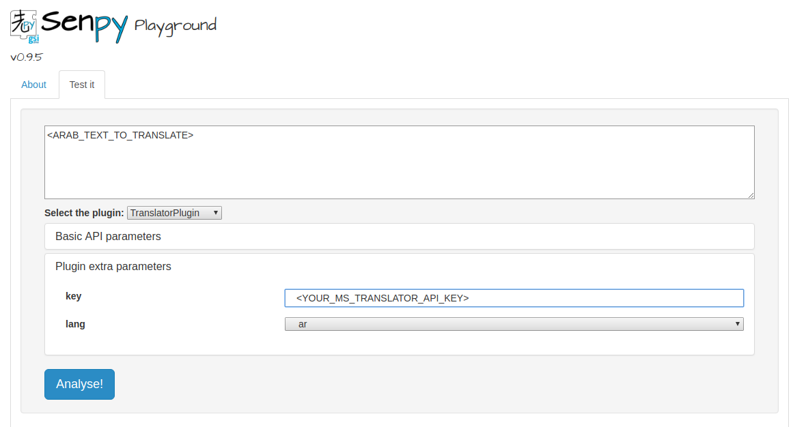

# Bing Translator Senpy Plugin

Plugin for translation using Bing. 

An API key from portal.azure.com should be created to use the Bing Service. See Microsoft Translator API Documentation: http://docs.microsofttranslator.com/. 


## Setup

First,  clone this repo.

```
git clone http://lab.cluster.gsi.dit.upm.es/senpy/translator-bing.git
```

Then, move into your repository folder and start the docker container.

``` 
cd translator-bing/
docker-compose up 
```

## Programmatical access

Run the following query, being 
* SOURCE_TEXT the text you want to translate 
* LANG the target language (e.g. ar for Arabic, en for English, etc.).
* YOUR_MS_TRANSLATOR_API_KEY your API key created from portal.azure.com.

localhost:5000/api?algo=TranslatorPlugin&i=<SOURCE_TEXT>&conversion=full&expanded-jsonld=false&informat=text&intype=direct&outformat=json-ld&urischeme=RFC5147String&with_parameters=false&lang=<LANG>&key=<YOUR_MS_TRANSLATOR_API_KEY>
``` 
## Web interface access

1. Go to your web browser and search _localhost:5000_.
2. Insert your Microsoft Translator API key.
3. Paste you text and click the Analyse button.


